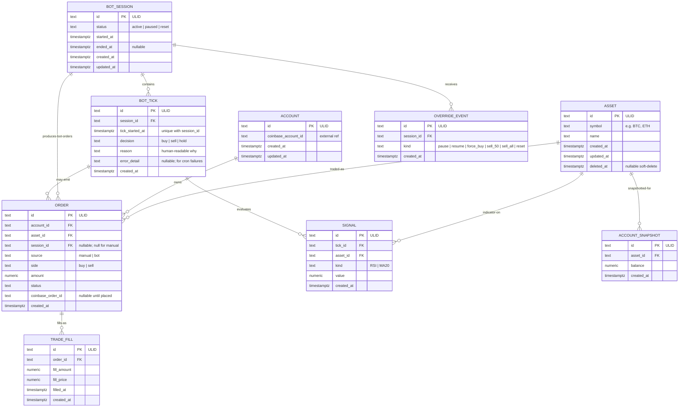

# Foundational Architecture Bet — Crypto DCA Bot

> The platform's load-bearing technical decisions, as a wager. A Next.js 16 App Router monorepo deployed on Vercel Pro, backed by Supabase Postgres for the trade ledger and bot-tick log (DB-only — auth lives in our own app layer per the product bet's "no third-party identity provider in the auth path" posture), with Vercel Cron at `*/15` precision driving the bot, passkey-only authentication via SimpleWebAuthn + custom DB-backed signed-cookie sessions, Coinbase Advanced Trade REST via a maintained TypeScript SDK, Sentry free tier for application errors, Vercel encrypted env vars for secrets, and GitHub Actions for pre-merge lint/typecheck/test.

## Context

Constraints shaping this architecture:

- **Solo developer** — no team, no division of labor. Op-ex budget is "what one person can sustainably operate." Resume-driven complexity is the named anti-pattern.
- **Single operator (n=1)** — no multi-tenant. Workload (1 user, 96 ticks/day, < 100MB/year data) is at the bottom end of any platform's tier.
- **Real money at stake** — Coinbase live-mode trading is supported (gated behind explicit env-var ceremony per product bet). Security posture must match: encrypted secrets, scoped API keys, auth on every capital-touching surface.
- **Coinbase only** — exchange choice is a one-way door at the product-bet level ([product.md § Scope](product.md#scope)). Architecture inherits.
- **Cron-driven, not always-on** — explicit product principle ([product.md § Key design choices](product.md)). No long-lived bot processes; 15-min ticks.
- **Web-only UI** — single device class; no mobile, no email/SMS, no Telegram. Single source of truth is the dashboard.
- **Passkey-only auth posture** — operator-owned credentials, no third-party identity provider in the auth path ([product.md § Identity & Access Posture](product.md#identity--access-posture)).
- **Year-1 infra budget ceiling ≤ $50/mo** — derived from product bet's solo-project scale. Comfortable headroom is the goal, not absolute minimum.

## Fitness Functions

The measurable architectural targets this bet must satisfy. ≥1 per Well-Architected pillar (6 minimum). Empty rows fail verification. These are the bet's falsification criteria.

| Pillar                 | Function (measurable)                                                                                                                                                                                                                                                                                                            | Threshold                                                                                                                                                                                                   | Source / rationale                                                                                                                                                                                                                               |
| ---------------------- | -------------------------------------------------------------------------------------------------------------------------------------------------------------------------------------------------------------------------------------------------------------------------------------------------------------------------------- | ----------------------------------------------------------------------------------------------------------------------------------------------------------------------------------------------------------- | ------------------------------------------------------------------------------------------------------------------------------------------------------------------------------------------------------------------------------------------------ |
| Reliability            | Bot tick execution rate (cron fires + tick completes end-to-end without error)                                                                                                                                                                                                                                                   | **≥ 99%** of scheduled ticks over rolling 30-day window                                                                                                                                                     | Derived from [product.md § Annual KR3](product.md#annual-12-months-from-approval) — "30+ consecutive uninterrupted dry-run sessions" implies high cron reliability                                                                               |
| Security               | (a) Zero secrets in repo (CI-enforced via gitleaks/secret-scan); (b) every capital-touching route gated by session cookie validated against `auth_sessions` row; (c) Coinbase API keys created Trade-only (no Withdraw / no Transfer) at Coinbase platform; (d) live-mode `LIVE_MODE` env var is a separate secret from API keys | (a) PR is rejected if secrets present; (b) integration test verifies unauthenticated request to capital-touching route returns 401; (c) manually verified at scaffold setup; (d) verified at scaffold setup | Derived from [product.md § Identity & Access Posture](product.md#identity--access-posture) (primary access posture named); [product.md § Guardrail metrics](product.md#guardrail-metrics) (zero auth bypasses; zero unintended live-mode trades) |
| Performance efficiency | Dashboard p95 load time + Coinbase API call budget per tick                                                                                                                                                                                                                                                                      | **p95 < 500ms** for dashboard pages; **< 10% of Coinbase rate-limit** per minute used                                                                                                                       | Human-perceptible budget for solo dashboard ([arch-research.md §2.2](architecture-research.md#2-benchmarks)); rate-limit headroom keeps tick reliable                                                                                            |
| Cost optimization      | Year-1 monthly infra spend                                                                                                                                                                                                                                                                                                       | **≤ $50/mo**                                                                                                                                                                                                | Derived from solo-project budget assumption; ~$21/mo projected leaves ~140% headroom ([arch-research.md §5 Cost](architecture-research.md#5-pillar-fit))                                                                                         |
| Operational excellence | (a) Deploy frequency capability — `git push` triggers deploy without manual steps; (b) MTTR (rollback time)                                                                                                                                                                                                                      | (a) Any commit deploys via Vercel + GitHub integration with zero manual ops; (b) **< 5 min** rollback via Vercel dashboard or `git revert`                                                                  | Derived from solo-dev sustainability; documented in `compass/config.yaml` `ci_cd` section                                                                                                                                                        |
| Sustainability         | n/a at n=1 single-region scale                                                                                                                                                                                                                                                                                                   | n/a — revisit if scope ever shifts to multi-tenant SaaS (would trigger a foundation amend)                                                                                                                  | Honest — not load-bearing for a single-operator product                                                                                                                                                                                          |

## Decision

A **Next.js 16 App Router monorepo deployed on Vercel Pro** ($20/mo for `*/15` cron precision), backed by **Supabase Postgres** on the free tier for the trade ledger and bot-tick log (**DB-only** — Supabase Auth is explicitly NOT used; auth stays in the app layer per [product.md § Identity & Access Posture](product.md#identity--access-posture)), with **Vercel Cron (Pro tier, `*/15 * * * *`)** driving the bot at minute-precise cadence, **passkey-only authentication via SimpleWebAuthn + custom signed-cookie sessions** gating the dashboard (multi-device passkey registration + offline backup recovery code), **Coinbase Advanced Trade REST** via a maintained TypeScript SDK, **Sentry free tier** for application errors, **Vercel encrypted env vars** for secrets, and **GitHub Actions** for pre-merge lint/typecheck/test.

## Foundational Data Model

Conventions every bet inherits. Decided **before** the DB choice — DB row in the Stack table cites this section.

### Core entities

Each entity traces back to a line in `docs/foundation/product.md`. No invented entities.

| Entity            | Purpose                                                                                   | Traces back to (product bet line / quote)                                                                                                                                                        |
| ----------------- | ----------------------------------------------------------------------------------------- | ------------------------------------------------------------------------------------------------------------------------------------------------------------------------------------------------ |
| `Asset`           | Cryptocurrency identifier (BTC, ETH, ...)                                                 | "Trades top 5 cryptos via Coinbase" — [product.md § Target users](product.md#target-users--personas)                                                                                             |
| `Account`         | Operator's Coinbase account state snapshot                                                | "Account balances refreshed every 15 sec" — [product.md § In scope](product.md#in-scope)                                                                                                         |
| `Order`           | Manual or bot-placed Coinbase order (separated by `source`)                               | "Order placement..." + "manual orders logged separately from bot orders" — [product.md § In scope](product.md#in-scope)                                                                          |
| `TradeFill`       | Executed-trade record returned by Coinbase                                                | "Full trade history" — [product.md § In scope](product.md#in-scope)                                                                                                                              |
| `BotSession`      | A contiguous run of the bot, operator-resettable                                          | "Reset session..." + "session start" — [product.md § In scope](product.md#in-scope)                                                                                                              |
| `BotTick`         | One 15-min decision evaluation by the bot                                                 | "Bot ticks every 15 minutes..." + "decision log (RSI, MA, signal source, intended action, reason)" — [product.md § Current quarter KR2](product.md#current-quarter-q2-2026--through-end-of-july) |
| `Signal`          | RSI / 20MA value computed at a moment in time                                             | "current RSI / MA" — [product.md § In scope](product.md#in-scope)                                                                                                                                |
| `OverrideEvent`   | Manual override the operator issued (pause, resume, force buy, sell 50%, sell all, reset) | "Manual override buttons" — [product.md § In scope](product.md#in-scope)                                                                                                                         |
| `AccountSnapshot` | Periodic snapshot of balances (for historical position view)                              | "Real-time state: status, ETH held, average cost..." — [product.md § In scope](product.md#in-scope)                                                                                              |

### Identity strategy

**ULID** (Crockford base32, 26 chars, time-sortable) for primary keys across all entities.

Rationale: time-sortable PKs eliminate the need for `(created_at, id)` compound indices on append-heavy tables (`bot_ticks`, `trade_fills`); 128-bit space is overkill at n=1 but zero cost; external-API safe (no internal-state leak from sequential IDs); Postgres `text` column is fine for the 26-char representation (UUIDv7 in a native `uuid` column is a noted alternative but ULID-as-text is more debuggable and matches external-tool expectations).

### Tenancy model

**Single-tenant.** No `tenant_id` columns, no row-level security. Derived from [product.md § Out of scope (NEVER)](product.md#out-of-scope-never) — "Multi-tenant / SaaS — strict single-operator product." Speculative tenancy columns are the named anti-pattern. If scope ever shifts to multi-tenant, that's a foundation amend with a new ADR.

### Audit / event-sourcing posture

**Append-only event log** for `bot_ticks`, `orders`, `trade_fills`, `override_events`, `account_snapshots`. Tables are append-only at the application layer — no UPDATE paths from app code. Operational state (e.g., `bot_sessions.status`) lives in mutable columns; **decision history** lives in immutable tick rows.

Derived from "full decision-trace observability" in [product.md § In scope](product.md#in-scope) and the dry-run-first product principle — every bot decision must be recoverable post-hoc for the operator to trust the system.

### Delete posture

- **Append-only tables** (`bot_ticks`, `orders`, `trade_fills`, `override_events`, `account_snapshots`): **never deleted**. Even bot session "reset" doesn't delete history — it ends the current `BotSession` and starts a new one. Quote from [product.md](product.md): "Reset clears the session ledger, not the exchange" — the _active session_ is the ledger; old sessions stay queryable.
- **Mutable config rows** (`bot_sessions.status`, `assets` configuration): **soft delete** with `deleted_at` timestamp.
- **Infrastructure tables** (`auth_credentials`, `auth_sessions`, `auth_recovery_codes`): see [Foundational Identity & Access Posture § Secrets-at-rest](#secrets-at-rest) for their delete semantics.

### PII / sensitive-data handling

No third-party PII (single-operator product). Sensitive assets:

- **Coinbase API keys** — stored ONLY in Vercel encrypted env vars; never in DB; never in logs
- **Trade ledger** — operator-private but not "PII" in the regulatory sense
- **`auth_credentials.public_key`** — public-key cryptography material; not sensitive on its own (the private key never leaves the operator's authenticator hardware)
- **`auth_recovery_codes.code_hash`** — Argon2id hash with server-side pepper; never stored in plaintext

No encryption-at-rest beyond what Supabase Postgres provides at the platform layer; Vercel encrypted env handles secrets.

### Timestamps convention

UTC, stored as Postgres `timestamptz` (timezone-aware). Every table has:

- `created_at timestamptz NOT NULL DEFAULT now()` (insert-time)
- `updated_at timestamptz NOT NULL DEFAULT now()` (mutable tables only; bumped on update via trigger or app code)

Deleted markers (`deleted_at timestamptz`) only on soft-deletable tables.

### Migration strategy

**Expand-contract** for schema changes. The bot runs continuously; downtime should be minimal even for a single-operator product (a missed tick is a missed signal). Schema versioned in `db/migrations/NNNN-<slug>.sql` (sequential, never edited after merge). Migration runner is part of the application bootstrap (`lib/db/migrate.ts`); runs at deploy time. Postgres SQL dialect; can use Supabase Studio for ad-hoc inspection but never as a migration source-of-truth (all schema changes go through migration files for repeatability).

### High-level ERD



### Infrastructure tables (derived from Security pillar fitness functions)

These tables do not appear in the Core Entities table because they don't trace to product nouns — they implement the [Foundational Identity & Access Posture](#foundational-identity--access-posture) section below, which derives from the Security pillar fitness functions ([§ Fitness Functions](#fitness-functions)). Declared here for completeness; kept distinct from product entities so future architects can tell which tables exist to satisfy product semantics vs which exist to satisfy platform security.

| Table                 | Purpose                                                                                                                                                                                                                          |
| --------------------- | -------------------------------------------------------------------------------------------------------------------------------------------------------------------------------------------------------------------------------- |
| `auth_users`          | The single operator row (single-tenant; one row total)                                                                                                                                                                           |
| `auth_credentials`    | Registered passkey credentials: `credential_id`, `public_key`, `counter`, `device_label`, `created_at`, `last_used_at`. Multiple rows per user (multi-device registration).                                                      |
| `auth_sessions`       | Cookie-backing session rows: `id`, `user_id`, `expires_at`, `created_at`, `rotated_at`. Cookie is signed against an env-stored secret; the cookie alone is not trusted — every authenticated request validates against this row. |
| `auth_recovery_codes` | Single-use offline backup codes: `code_hash` (Argon2id), `used_at` (null until consumed), `created_at`. One row per code at setup; consumed-on-use.                                                                              |

## Foundational Identity & Access Posture

Implements [`docs/foundation/product.md` § Identity & Access Posture](product.md#identity--access-posture). Same heavyweight depth as the Foundational Data Model section above — the Auth row in the Stack table is the _implementation pointer_, not the decision itself.

### Data sensitivity

Cites [product.md § Data classification](product.md#data-classification): **operator-only, with high real-money sensitivity**. The sensitive assets at the architecture layer are Coinbase API keys (live in Vercel encrypted env), the trade ledger (immutable rows in Supabase Postgres), and the `LIVE_MODE` env flag (the load-bearing safety primitive).

### Authenticated surface enumeration

Every route that touches sensitive operations, with the gate that protects it. **Empty cells in this table are a deploy-blocking failure.**

| Surface                                                               | Gate                                                                                                                                                                                      |
| --------------------------------------------------------------------- | ----------------------------------------------------------------------------------------------------------------------------------------------------------------------------------------- |
| All `/(dashboard)/*` route group (dashboard, manual trading, history) | passkey session cookie validated against `auth_sessions` row                                                                                                                              |
| `/api/coinbase/*` (price, balance, order)                             | passkey session cookie validated against `auth_sessions` row                                                                                                                              |
| `/api/bot/*` (pause, resume, override, reset)                         | passkey session cookie validated against `auth_sessions` row                                                                                                                              |
| `/api/auth/register/*`                                                | unauthenticated entry point — rate-limited; origin check; only callable when zero passkeys exist (initial-setup ceremony) OR by an authenticated session (additional-device registration) |
| `/api/auth/authenticate/*`                                            | unauthenticated entry point — rate-limited; origin check; consumes a WebAuthn challenge                                                                                                   |
| `/api/auth/recovery/*`                                                | unauthenticated entry point — rate-limited (stricter than the others); origin check; consumes one of the recovery codes                                                                   |
| `/api/cron/tick`                                                      | `CRON_SECRET` header verification (Vercel-injected `vercel-cron/1.0` user agent + `x-vercel-cron-schedule` header as defense-in-depth)                                                    |
| Static assets, public landing (if any)                                | unauthenticated                                                                                                                                                                           |

### Credential strategy

**Passkey via SimpleWebAuthn** (`@simplewebauthn/server` + `@simplewebauthn/browser`). Industry-standard library; production-stable; underlies Auth.js's WebAuthn provider (which is still flagged "experimental, not yet recommended for production use" as of early 2026 per [Auth.js WebAuthn docs](https://authjs.dev/getting-started/authentication/webauthn) and [arch-research.md §1.4](architecture-research.md#1-prior-art)).

Operator registers ≥ 2 passkeys at initial setup. Platform-synced passkeys (iCloud Keychain / Google Password Manager / Windows Hello) are recognized at AAL2 per NIST SP 800-63-4 (finalized July 2025) and count as legitimate redundancy.

### Session strategy

**Custom signed cookie + DB-backed validation.**

- **Cookie attributes:** `HttpOnly` + `Secure` + `SameSite=Strict` + `Path=/`
- **Signing:** HMAC-SHA256 against `SESSION_SIGNING_SECRET` env (Vercel encrypted; rotated quarterly per the runbook)
- **Source of truth:** the cookie carries only a session id; every authenticated request loads the `auth_sessions` row by id and verifies `expires_at > now()`. **The cookie alone is not trusted** — DB row is the source of truth, which protects against session-fixation even on cookie compromise
- **TTL:** 30 days of inactivity; sliding expiry (each authenticated request bumps `expires_at`)
- **Rotation:** new session id on each successful passkey authentication; the prior session id is invalidated immediately (no overlap window)
- **Storage location:** `auth_sessions` rows in Supabase Postgres (n=1, < ~10 active rows ever; trivial footprint)

### Recovery posture

Multi-device passkey registration **+** one single-use offline backup recovery code.

- **Multi-device:** operator registers a passkey on at least two devices at setup (Mac + phone is the canonical pairing; iCloud / Google / Windows sync makes this near-automatic on platform devices). UI nudges the operator to confirm a second-device registration before exiting the setup ceremony.
- **Backup code:** one single-use code generated at setup, displayed exactly once, stored offline by the operator (password manager / paper). Hash is Argon2id with a server-side pepper from `RECOVERY_CODE_PEPPER` env. On consumption, the row's `used_at` is set; redemption flow forces immediate registration of a replacement passkey before exit.

Worst-case lockout: simultaneous loss of all registered devices AND the offline backup code. At that point, recovery requires manual DB intervention (operator opens Supabase SQL Editor or `psql`, deletes the `auth_credentials` rows, registers fresh credentials). Documented in the Phase B scaffold runbook as the absolute-last-resort path. This matches [product.md § PM Risk #7](product.md#risks).

### Attack-surface analysis

If a session cookie is exfiltrated _and_ the attacker reaches the application URL before the session is rotated, they reach the same surface area the operator does: read account state, place bot-control commands, read trade history. **Capital exfiltration remains impossible** because Coinbase API keys are scoped Trade-only (no Withdraw / no Transfer) at the Coinbase platform layer — independent of our auth posture. The reserve floor and per-session deployment caps in [product.md § In scope](product.md#in-scope) bound the worst-case unwanted-trade damage.

If a passkey credential is exfiltrated (hardware compromise; far less likely than cookie compromise), the attacker still needs to reach our application origin (WebAuthn binds credentials to origin), which means they need a phishing/proxy path — passkey is structurally phishing-resistant compared to any password/OTP scheme.

If the `SESSION_SIGNING_SECRET` is exfiltrated, the attacker can forge cookie signatures for any session id — but the `auth_sessions` row lookup still fails for ids the attacker doesn't know. Rotating the signing secret invalidates all sessions (forced re-authentication of all devices), which is the documented response.

If `RECOVERY_CODE_PEPPER` is exfiltrated alongside a database dump, brute-forcing the recovery code becomes feasible (256-bit space is large, but offline brute-force is unbounded by rate limits). Mitigation: rotate pepper + regenerate recovery code on any suspected env-var compromise. The pepper is in Vercel encrypted env (same boundary as the Coinbase API keys); compromise of the pepper alone (without the DB dump) is harmless.

### Secrets-at-rest

All in Vercel Environment Variables (encrypted at rest by Vercel; not in repo; not logged):

- `COINBASE_API_KEY`, `COINBASE_API_SECRET` (Trade-only scoped; rotation quarterly per runbook)
- `LIVE_MODE` (boolean — drives dry-run vs live)
- `SESSION_SIGNING_SECRET` (HMAC key; rotation quarterly; rotation = forced reauth)
- `RECOVERY_CODE_PEPPER` (server-side pepper for Argon2id; rotation requires regenerating recovery code)
- `CRON_SECRET` (Vercel-injected secret; verified at `/api/cron/tick`)
- `DATABASE_URL` (Supabase Postgres connection string — pooler endpoint; copied from Supabase dashboard into Vercel env)

Rotation procedure for each is documented in the Phase B scaffold runbook.

## Stack

Every row scored on all 6 pillars in the per-row evaluations below. Reversibility evidence-backed in [arch-research.md §6](architecture-research.md#6-reversibility-honesty).

**The Database row cites the [Foundational Data Model](#foundational-data-model) section above** — the Supabase Postgres choice follows from the entity shape (small, append-heavy, single-writer, time-sortable), the ULID identity strategy, the single-tenant model, and the append-only audit posture; the operator already has a Supabase account, removing a vendor from the stack.

**The Auth library row cites the [Foundational Identity & Access Posture](#foundational-identity--access-posture) section above** — the SimpleWebAuthn + custom session choice follows from the posture's credential strategy, session strategy, recovery posture, and attack-surface analysis. Per-pillar reasoning lives in the Posture section, not duplicated in a row-level evaluation.

| Concern                | Choice                                                                                                                                                                 | Reversibility |
| ---------------------- | ---------------------------------------------------------------------------------------------------------------------------------------------------------------------- | ------------- |
| Repo shape             | Monorepo (single Next.js app; no Turborepo at this scale)                                                                                                              | medium        |
| Backend language       | TypeScript (Node 20+)                                                                                                                                                  | medium        |
| Backend framework      | Next.js 16 App Router (route handlers as backend)                                                                                                                      | medium        |
| Frontend framework     | Next.js 16 App Router (Server Components + Client Components)                                                                                                          | medium        |
| Mobile framework       | n/a — out of scope per [product.md § Out of scope (NEVER)](product.md#out-of-scope-never)                                                                              | n/a           |
| Database               | **Supabase Postgres (free tier — DB only; Supabase Auth NOT used)** — see [Foundational Data Model](#foundational-data-model)                                          | medium        |
| Contracts format       | Internal-only typed (TypeScript types + Zod schemas at API boundaries). No external API; no OpenAPI/tRPC overhead.                                                     | easy          |
| Auth library           | **SimpleWebAuthn (server + browser) + custom DB-backed signed-cookie sessions** — see [Foundational Identity & Access Posture](#foundational-identity--access-posture) | easy          |
| Deployment target      | Vercel Pro ($20/mo — required for `*/15` cron precision)                                                                                                               | medium        |
| CI/CD platform         | GitHub Actions (pre-merge: lint, typecheck, test, secret scan) + Vercel (deploy on push to main)                                                                       | medium        |
| Cron host              | Vercel Cron Jobs (Pro tier; `*/15 * * * *`)                                                                                                                            | medium        |
| Observability          | Sentry free Developer plan + Vercel built-in logs + in-app `bot_ticks` audit                                                                                           | easy          |
| Secrets management     | Vercel Environment Variables (encrypted)                                                                                                                               | hard          |
| Infrastructure-as-code | None — `vercel.ts` typed project config + SQL migrations + GH Actions YAML. No Terraform/Pulumi at this scale.                                                         | easy          |

### Per-row pillar evaluation + research citations

#### Repo shape: Monorepo

| Pillar                 | Score | Rationale                                                                                                        | Research citation                                                                                                                   |
| ---------------------- | ----- | ---------------------------------------------------------------------------------------------------------------- | ----------------------------------------------------------------------------------------------------------------------------------- |
| All applicable pillars | good  | Single application, single deploy unit, single dependency tree. Turborepo/workspace overhead unjustified at n=1. | [arch-research.md §1.1](architecture-research.md#1-prior-art) — solo-dev pattern; knowledge-update injection re: Next.js App Router |
| Sustainability         | n/a   | n/a                                                                                                              | —                                                                                                                                   |

#### Backend language: TypeScript (Node 20+)

| Pillar                 | Score | Rationale                                                                                                      | Research citation                                 |
| ---------------------- | ----- | -------------------------------------------------------------------------------------------------------------- | ------------------------------------------------- |
| Reliability            | good  | Node 24 LTS is current default on Vercel per knowledge-update; broad ecosystem maturity                        | Knowledge-update injection at session start       |
| Security               | good  | Strict TypeScript + Zod runtime validation at boundaries catches whole classes of bugs at the type layer       | Standard TS+Zod pattern                           |
| Performance efficiency | good  | Vercel Fluid Compute reuses Node instances (knowledge-update); cold-start risk minimized for low-traffic ticks | Knowledge-update injection re: Fluid Compute      |
| Cost optimization      | good  | Active-CPU pricing on Vercel rewards bursty cron workloads (knowledge-update)                                  | Knowledge-update injection re: Active CPU pricing |
| Operational excellence | good  | TypeScript single-language stack (front + back + signals) eliminates context-switching tax for solo dev        | —                                                 |
| Sustainability         | n/a   | n/a                                                                                                            | —                                                 |

#### Backend framework: Next.js 16 App Router

| Pillar                 | Score | Rationale                                                                                                                                     | Research citation                                                                             |
| ---------------------- | ----- | --------------------------------------------------------------------------------------------------------------------------------------------- | --------------------------------------------------------------------------------------------- |
| Reliability            | good  | Vercel-owned framework; LTS release cadence; route handlers are battle-tested                                                                 | Knowledge-update injection at session start                                                   |
| Security               | good  | Server Components default; explicit `'use client'` opt-in for interactivity (smaller client surface); `proxy.ts` handles session-gate routing | Knowledge-update injection at session start (re: proxy.ts, NOT middleware.ts in Next.js 16)   |
| Performance efficiency | good  | Server Components + streaming + Cache Components available if needed later                                                                    | [Next.js Cache Components docs](https://nextjs.org/docs/app/getting-started/cache-components) |
| Cost optimization      | good  | Free framework; no licensing cost                                                                                                             | —                                                                                             |
| Operational excellence | good  | First-class Vercel integration; deploy on push to main                                                                                        | [arch-research.md §1.1, §1.2](architecture-research.md#1-prior-art)                           |
| Sustainability         | n/a   | n/a                                                                                                                                           | —                                                                                             |

#### Frontend framework: Next.js 16 App Router

Same evaluation as Backend framework above (same package; same scores).

#### Mobile framework: n/a

Out of scope per [product.md § Out of scope (NEVER)](product.md#out-of-scope-never). All pillars n/a.

#### Database: Supabase Postgres (DB only)

**Cites [Foundational Data Model](#foundational-data-model) — choice derived from data shape (small, append-heavy, single-writer, time-sortable ULID PKs), single-tenant, append-only audit posture.**

**Supabase Auth is explicitly NOT used.** Only the Postgres DB feature is consumed. Auth stays on SimpleWebAuthn + custom signed-cookie sessions per [Foundational Identity & Access Posture](#foundational-identity--access-posture), implementing the product bet's "no third-party identity provider in the auth path" posture ([product.md § Identity & Access Posture](product.md#identity--access-posture)). Supabase Auth (GoTrue) is a managed auth service and would violate that posture. Likewise, Supabase Row-Level Security (RLS) is available but **unused at n=1 single-tenant** — auth gating happens at the app layer via `auth_sessions` row validation.

| Pillar                 | Score     | Rationale                                                                                                                                                                                                                                                           | Research citation                                                                                                   |
| ---------------------- | --------- | ------------------------------------------------------------------------------------------------------------------------------------------------------------------------------------------------------------------------------------------------------------------- | ------------------------------------------------------------------------------------------------------------------- |
| Reliability            | good      | Postgres WAL durability; Supabase managed daily backups (7-day retention on free tier); 15-min cron keeps the project active (free-tier projects pause after 7 days of inactivity — non-issue for a cron-driven app)                                                | [Supabase pricing](https://supabase.com/pricing); [arch-research.md §3.7](architecture-research.md#3-vendor-health) |
| Security               | good      | Postgres encryption at rest; TLS in transit; we connect via service-role connection string in Vercel encrypted env; **no Supabase Auth** means no IdP-in-path concern                                                                                               | [Supabase security docs](https://supabase.com/docs/guides/platform/security)                                        |
| Performance efficiency | good      | Workload (~14k reads/month) is far under Supabase free-tier ceilings; sub-10ms query latency for our shapes; PgBouncer connection pooling bundled (irrelevant at n=1 but available if scope grows)                                                                  | [arch-research.md §2.1](architecture-research.md#2-benchmarks)                                                      |
| Cost optimization      | excellent | Free tier (500MB DB, unlimited API requests, 1GB egress) covers projected workload with > 4 OOM headroom; **reuses an account the operator already has** (one fewer vendor in the stack vs. Turso)                                                                  | [Supabase pricing](https://supabase.com/pricing); [arch-research.md §5](architecture-research.md#5-pillar-fit)      |
| Operational excellence | good      | Single connection string (`DATABASE_URL`); migrations are plain SQL files; Postgres tooling (psql, pgcli, Postico, Supabase Studio) is the most universal DB tooling there is; migration source-of-truth stays in `db/migrations/` (never Studio-edited at runtime) | [arch-research.md §3.7](architecture-research.md#3-vendor-health)                                                   |
| Sustainability         | n/a       | n/a                                                                                                                                                                                                                                                                 | —                                                                                                                   |

#### Contracts format: Internal-only typed (TS + Zod)

| Pillar                 | Score | Rationale                                                                                    | Research citation |
| ---------------------- | ----- | -------------------------------------------------------------------------------------------- | ----------------- |
| All applicable pillars | good  | No external API surface to version; no clients to publish; tRPC/OpenAPI overhead unjustified | —                 |
| Sustainability         | n/a   | n/a                                                                                          | —                 |

#### Auth library: SimpleWebAuthn + custom signed-cookie session

**Full per-pillar evaluation lives in the heavyweight [Foundational Identity & Access Posture](#foundational-identity--access-posture) section above.** That section captures Reliability (multi-device + backup-code recovery; SimpleWebAuthn production-stable per [arch-research.md §1.4](architecture-research.md#1-prior-art)), Security (phishing-resistant, hardware-backed, no third-party IdP, DB-validated sessions), Performance (sub-ms server validation, ~100-300ms passkey round-trip), Cost (free libraries, no auth-as-a-service), Operational excellence (custom session is ~50-80 LOC; explicit owned-responsibility trade-off documented as a named Risk), and Sustainability (n/a at n=1). Stack row backlinks the Posture section the same way the Database row backlinks the Foundational Data Model section.

#### Deployment target: Vercel Pro

| Pillar                 | Score      | Rationale                                                                                                           | Research citation                                                        |
| ---------------------- | ---------- | ------------------------------------------------------------------------------------------------------------------- | ------------------------------------------------------------------------ |
| Reliability            | good       | 99.99% uptime SLA on Pro; immutable deployments; instant rollback                                                   | [Vercel pricing](https://vercel.com/pricing)                             |
| Security               | good       | Platform-managed TLS; env-var encryption; DDoS protection at edge                                                   | Vercel platform docs (general)                                           |
| Performance efficiency | good       | Edge network; Fluid Compute instance reuse reduces cold starts (knowledge-update)                                   | Knowledge-update injection re: Fluid Compute                             |
| Cost optimization      | acceptable | $20/mo is the _cost_ of `*/15` cron precision — explicitly evaluated against $50/mo ceiling; ~140% headroom remains | [arch-research.md §2.3, §4.3, §5](architecture-research.md#2-benchmarks) |
| Operational excellence | good       | `git push` deploys; Vercel dashboard rollback; minimal ops surface                                                  | [arch-research.md §1.2](architecture-research.md#1-prior-art)            |
| Sustainability         | n/a        | n/a                                                                                                                 | —                                                                        |

#### CI/CD platform: GitHub Actions (pre-merge) + Vercel (deploy)

| Pillar                 | Score | Rationale                                                                            | Research citation                                                 |
| ---------------------- | ----- | ------------------------------------------------------------------------------------ | ----------------------------------------------------------------- |
| Reliability            | good  | GitHub Actions runs on every PR; Vercel deploy is gated by PR-merge to `main`        | Standard pattern                                                  |
| Security               | good  | GH Actions secret-scan + gitleaks pre-merge; Vercel rejects deploys with auth errors | Standard pattern                                                  |
| Cost optimization      | good  | Both free for personal repos at our usage                                            | [arch-research.md §5 Cost](architecture-research.md#5-pillar-fit) |
| Operational excellence | good  | Single workflow file (`.github/workflows/ci.yml`); Vercel auto-integration           | Standard pattern                                                  |
| Sustainability         | n/a   | n/a                                                                                  | —                                                                 |

#### Cron host: Vercel Cron Jobs (`*/15` schedule on Pro)

| Pillar                 | Score      | Rationale                                                                                                   | Research citation                                                    |
| ---------------------- | ---------- | ----------------------------------------------------------------------------------------------------------- | -------------------------------------------------------------------- |
| Reliability            | good       | Minute-precise on Pro; Vercel-injected headers for identity verification at the route                       | [arch-research.md §2.3, §4.2](architecture-research.md#2-benchmarks) |
| Security               | good       | `CRON_SECRET` header check + Vercel-injected user-agent as defense-in-depth                                 | [arch-research.md §1.2](architecture-research.md#1-prior-art)        |
| Performance efficiency | good       | Fluid Compute reuses instances between ticks (knowledge-update)                                             | Knowledge-update injection                                           |
| Cost optimization      | acceptable | Pro tier $20/mo — see Deployment target row                                                                 | [arch-research.md §5 Cost](architecture-research.md#5-pillar-fit)    |
| Operational excellence | good       | Cron defined in `vercel.ts` typed config (replaces vercel.json per knowledge-update); no external scheduler | Knowledge-update injection re: vercel.ts                             |
| Sustainability         | n/a        | n/a                                                                                                         | —                                                                    |

#### Observability: Sentry free + Vercel logs + in-app `bot_ticks` audit

| Pillar                 | Score | Rationale                                                                                                                               | Research citation                                                                               |
| ---------------------- | ----- | --------------------------------------------------------------------------------------------------------------------------------------- | ----------------------------------------------------------------------------------------------- |
| Reliability            | good  | Sentry surfaces uncaught errors; `bot_ticks.error_detail` column means cron failures are operator-visible even if Sentry quota exhausts | [arch-research.md §3.3, §4.4](architecture-research.md#3-vendor-health)                         |
| Cost optimization      | good  | Sentry free; Vercel logs included                                                                                                       | [arch-research.md §5 Cost](architecture-research.md#5-pillar-fit)                               |
| Operational excellence | good  | Bot-decision audit in DB (not Sentry-only) means operator can review every tick history-of-record                                       | Derived from [product.md § In scope](product.md#in-scope) — "full decision-trace observability" |
| Sustainability         | n/a   | n/a                                                                                                                                     | —                                                                                               |

#### Secrets management: Vercel Environment Variables

| Pillar                 | Score | Rationale                                                                                                                                | Research citation                                                                     |
| ---------------------- | ----- | ---------------------------------------------------------------------------------------------------------------------------------------- | ------------------------------------------------------------------------------------- |
| Reliability            | good  | Platform-managed; encrypted at rest; injected to function runtime                                                                        | Knowledge-update injection at session start                                           |
| Security               | good  | No Vault layer needed at this scale; rotation via Vercel CLI/dashboard                                                                   | Knowledge-update injection                                                            |
| Operational excellence | good  | Single dashboard / CLI surface; well-trodden                                                                                             | Standard pattern                                                                      |
| Reversibility          | hard  | Migrating away from Vercel means exporting and re-injecting every env var on the new host — manageable but documented as `hard` honestly | [arch-research.md §6 Reversibility](architecture-research.md#6-reversibility-honesty) |
| Sustainability         | n/a   | n/a                                                                                                                                      | —                                                                                     |

#### Infrastructure-as-code: None (config files only)

| Pillar                 | Score | Rationale                                                                                                                                                          | Research citation                                                                          |
| ---------------------- | ----- | ------------------------------------------------------------------------------------------------------------------------------------------------------------------ | ------------------------------------------------------------------------------------------ |
| All applicable pillars | good  | At this scale, Terraform/Pulumi would be ceremony without function; `vercel.ts` typed project config + SQL migrations + GH Actions YAML cover the entire substrate | Knowledge-update at session start re: `vercel.ts`; industry consensus for solo/indie scale |
| Cost optimization      | good  | No IaC tooling cost; no remote-state backend cost                                                                                                                  | [arch-research.md §5](architecture-research.md#5-pillar-fit)                               |
| Sustainability         | n/a   | n/a                                                                                                                                                                | —                                                                                          |

## Boundaries (initial)

Directory structure all bets start from:

```
app/                              # Next.js App Router
  (dashboard)/                    # session-gated route group
    page.tsx                      # bot dashboard
    manual/page.tsx               # manual trading UI
    history/page.tsx              # trade history
  api/
    cron/
      tick/route.ts               # bot tick endpoint (GET; CRON_SECRET-gated)
    coinbase/                     # Coinbase API proxy (session-gated)
      price/route.ts
      balance/route.ts
      order/route.ts
    bot/                          # bot control (session-gated)
      pause/route.ts
      resume/route.ts
      override/route.ts
      reset/route.ts
    auth/                         # passkey auth (unauthenticated entry points; rate-limited; origin-checked)
      register/route.ts           # passkey registration begin/finish
      authenticate/route.ts       # passkey authentication begin/finish
      recovery/route.ts           # backup code redemption + forced credential rotation
  layout.tsx
  proxy.ts                        # session-gate routing (Next.js 16 proxy.ts, NOT middleware.ts)

lib/                              # domain logic — framework-independent
  signals/                        # RSI, MA calculators (pure functions)
  decisions/                      # entry/exit rule evaluators (pure functions)
  coinbase/                       # Coinbase API client wrapper
  db/                             # Postgres client (postgres.js) + queries + migration runner
  auth/                           # SimpleWebAuthn wrappers, session cookie verifier, Argon2id helper, recovery-code generator
  validation/                     # Zod schemas at API boundaries
  env/                            # typed env-var loader (validates at startup)

db/
  schema.sql                      # canonical DDL
  migrations/                     # NNNN-<name>.sql versioned migrations

components/                       # UI components (Server + Client)

tests/                            # Vitest unit tests; Playwright E2E (Reviewer-owned)

docs/                             # Compass artifacts (already present)
compass/                          # Compass framework (already present)

.github/workflows/                # CI: lint, typecheck, test, secret scan

vercel.ts                         # Vercel typed project config (replaces vercel.json) — defines crons here
next.config.ts
tsconfig.json
package.json
.env.example                      # documented env vars (no secrets)
```

## Cross-cutting standards

- **Logging:** structured JSON via `console.log` (captured by Vercel logs); no separate logger library at this scale; bot decisions logged to `bot_ticks` table (operator-readable, not just app-log)
- **Error handling:** typed errors at boundaries (Zod for inbound API; custom domain-error classes in `lib/`); errors at API boundary return shape `{ error: { code, message } }`; bot-tick errors caught and written to `bot_ticks.error_detail` column so the dashboard surfaces them
- **Naming:** kebab-case files (`bot-tick.ts`), PascalCase React components (`OrderForm.tsx`), camelCase functions/variables, SCREAMING_SNAKE_CASE for env vars
- **Testing:** Vitest for unit tests (domain logic in `lib/` is the highest-value test surface — signals, decisions); Playwright E2E owned by Reviewer (Codex) per AGENTS.md tool division
- **Observability:** Sentry for app-level errors (uncaught exceptions, API route failures); `bot_ticks` table for bot-decision audit; Vercel built-in logs for platform-level
- **Type discipline:** `strict: true` in `tsconfig`; no `any`; Zod validates at every API and DB boundary; env vars validated at startup via `lib/env`
- **Auth:** every route outside `/api/auth/*` and `/api/cron/*` requires a valid session cookie verified against an `auth_sessions` row (cookie signature alone is not trusted — DB row is the source of truth). Session cookies set `HttpOnly` + `Secure` + `SameSite=Strict`. Sessions rotate on each successful passkey authentication (prior session id invalidated immediately). Recovery codes hashed with Argon2id + server-side pepper. Origin check on all `/api/auth/*` POST flows as defense-in-depth against CSRF. See [Foundational Identity & Access Posture](#foundational-identity--access-posture) for full posture.

## Hypothesis (the bet)

If we ship a single-tenant Next.js 16 monorepo on Vercel Pro, with Supabase Postgres (DB only) for the trade ledger, Vercel Cron at `*/15` precision driving a stateless cron-and-exit bot, passkey-only authentication via SimpleWebAuthn + custom DB-backed signed-cookie sessions (multi-device + offline backup code) gating the dashboard, deterministic signal logic in framework-independent `lib/` modules, and dry-run mode as the default env-var posture, then **the bot tick reliability fitness function (≥ 99% of scheduled ticks execute end-to-end without error over a rolling 30-day window) will hold**, while keeping Year-1 infra spend ≤ $50/month, supporting the `product.md` hypothesis ([product.md § Hypothesis](product.md#hypothesis-the-bet)) over the 24-month measurement window without forcing a foundational stack amend.

## Guardrail metrics

What must NOT degrade for this architecture to count as won:

- **Year-1 monthly infra cost** stays **≤ $50/mo** (projected $21/mo; ~140% headroom acknowledged)
- **Deploy frequency capability** stays **multi-deploys/day possible** (no manual ops; `git push` deploys)
- **Rollback time** stays **< 5 min** via Vercel dashboard or `git revert`
- **Zero secrets in repo** at every PR (CI-enforced; rejecting PRs that fail secret scan is non-negotiable)
- **Zero unauthenticated capital-touching surfaces** — every `/api/coinbase/*`, `/api/bot/*`, `/(dashboard)/*` route must be verified session-gated (integration test or proxy.ts confirms)
- **Vendor lock-in concentration** stays **≤ medium reversibility** across all 13 stack rows (see [arch-research.md §6](architecture-research.md#6-reversibility-honesty)); any drift to `hard` or `one-way` requires an ADR amendment

## Alternatives considered

Evaluated against the declared fitness functions and pillars — not generic pros/cons. One real alternative for each load-bearing decision.

| Option                                                                                                | Fitness-function fit                                                                                                                                                                                                                                             | Pillar tradeoffs                                                                                 | Why rejected                                                                                                                                                                                                                                                                                                                                                                          |
| ----------------------------------------------------------------------------------------------------- | ---------------------------------------------------------------------------------------------------------------------------------------------------------------------------------------------------------------------------------------------------------------- | ------------------------------------------------------------------------------------------------ | ------------------------------------------------------------------------------------------------------------------------------------------------------------------------------------------------------------------------------------------------------------------------------------------------------------------------------------------------------------------------------------- |
| **Chosen: Vercel Pro + Next.js + Supabase Postgres (DB only) + Vercel Cron + SimpleWebAuthn passkey** | satisfies all Reliability (99% tick), Security (env-var encryption + CRON_SECRET + passkey-only operator-owned), Performance (n=1 budget), Cost ($20/mo of $50 ceiling — Supabase free tier), Op-excellence (git-push deploys; reuses existing Supabase account) | favors Reliability/Op-ex/Cost; neutral on Performance; strong on Security                        | —                                                                                                                                                                                                                                                                                                                                                                                     |
| **Alt A: Fly.io + Postgres (Neon) + GitHub Actions cron**                                             | fails Reliability (GitHub Actions 10-30 min cron delay > 15 min interval per [arch-research.md §4.2](architecture-research.md#4-failure-modes)); worse Cost (Fly's free tier + Neon free tier vs Vercel Pro is similar, but ops complexity higher)               | better in raw flexibility; worse in Op-excellence (more services, more config)                   | **Disqualified by Reliability fitness function** — GH Actions delay can exceed cron interval; also more ops surface for solo dev                                                                                                                                                                                                                                                      |
| **Alt B: Self-hosted VPS + always-on Node bot process + local Postgres + nginx**                      | fails Op-excellence (deploy frequency requires hand-deploy); worse Security (operator-managed TLS + secrets); satisfies Cost ($5-10/mo VPS); satisfies Reliability if maintained                                                                                 | unbeatable on lock-in (~zero) but worst on Op-excellence                                         | **Disqualified by Op-excellence fitness function** — "deploy frequency capability via git push" requires platform-managed deploy; also contradicts "cron-driven, not always-on" product principle                                                                                                                                                                                     |
| **Alt C: Cloudflare Workers + D1 (SQLite) + Cloudflare Triggers (cron)**                              | satisfies Reliability + Cost + Performance; weaker on Op-excellence for Next.js (Workers' Next.js story is improving but not as native as Vercel)                                                                                                                | better edge-locality (irrelevant for n=1 single region); cheaper at scale (irrelevant for n=1)   | **Rejected on Op-excellence + Vendor health balance** — Vercel + Next.js is the more battle-tested combination for the App Router patterns in use; D1 is newer than libSQL/Turso. Worth re-evaluating in a future amend if Vercel Pro pricing changes materially.                                                                                                                     |
| **DB Alt: Vercel Postgres**                                                                           | n/a — product sunset per knowledge-update injection at session start                                                                                                                                                                                             | —                                                                                                | **Disqualified — sunset product**; Vercel Marketplace integrations (Supabase, Neon, Turso) are the supported path                                                                                                                                                                                                                                                                     |
| **DB Alt: Local SQLite + Litestream backup**                                                          | satisfies Cost; fails Op-excellence — Vercel functions are stateless; SQLite file doesn't persist between invocations                                                                                                                                            | unbeatable on lock-in                                                                            | **Disqualified by Vercel stateless-function model** ([Turso serverless blog explains why](https://turso.tech/blog/serverless)); a managed cloud DB is required                                                                                                                                                                                                                        |
| **DB Alt: Turso libSQL (SQLite-on-cloud)**                                                            | satisfies all DB pillars; free tier ceilings 6 OOM under our workload                                                                                                                                                                                            | SQLite dialect (slightly more portable than Postgres in raw SQL terms); simpler driver footprint | **Rejected on vendor-consolidation grounds** — operator already has a Supabase account; adopting Turso would add a vendor to the stack for marginal benefit at n=1. Postgres tooling is universal (psql, Postico, pgcli) so the operational story is better with Supabase. Worth re-evaluating if the operator ever drops Supabase or if a future workload favors SQLite's footprint. |
| **DB Alt: Neon Postgres**                                                                             | satisfies all DB pillars; mature Postgres-as-a-service                                                                                                                                                                                                           | better at cold-start branch ergonomics (preview-DB-per-PR); not load-bearing at n=1              | **Rejected on vendor-consolidation grounds** — same reason as Turso: operator already has Supabase, so adopting Neon would add a vendor. If operator dropped Supabase, Neon would be the natural Postgres alternative; documented as such for future reference.                                                                                                                       |
| **Auth Alt: Auth.js v5 Passkey provider**                                                             | satisfies Security; richer ecosystem (middleware, adapters, session helpers)                                                                                                                                                                                     | better Op-excellence via library handling of session edge cases                                  | **Rejected** — Auth.js v5's Passkey provider is officially flagged "experimental, not yet recommended for production use" per [Auth.js WebAuthn docs](https://authjs.dev/getting-started/authentication/webauthn) as of early 2026. For a real-money tool, opting into beta API surface is the wrong trade. Chose the stable underlying library directly (SimpleWebAuthn).            |
| **Auth Alt: Hanko (managed passkey service)**                                                         | satisfies Security; offloads WebAuthn complexity                                                                                                                                                                                                                 | adds a vendor dependency in the auth path                                                        | **Rejected on vendor-surface grounds** — adds a third party in the auth chain of a real-money tool, contradicting the architecture's "minimize vendor surface" stance and the product's "no third-party identity provider in the auth path" posture per [product.md § Identity & Access Posture](product.md#identity--access-posture)                                                 |
| **Auth Alt: NextAuth (Auth.js) with single OAuth provider + email allowlist**                         | satisfies Security at a lower bar; simpler initial setup                                                                                                                                                                                                         | broader ecosystem                                                                                | **Rejected** — operator wants no third-party identity provider in the auth path for a real-money tool; passkey is phishing-resistant + operator-owned credentials per [product.md § Identity & Access Posture](product.md#identity--access-posture).                                                                                                                                  |

## Architecture Research

Full 6-category research with citations in [`docs/foundation/architecture-research.md`](architecture-research.md). Summary anchors:

- [§1 Prior art](architecture-research.md#1-prior-art) — Vercel + Supabase + Next.js solo-dev stack; cron-as-route-handler pattern; Coinbase TS SDK options; passkey/SimpleWebAuthn
- [§2 Benchmarks](architecture-research.md#2-benchmarks) — Supabase free-tier ceilings; Coinbase rate-limits; Vercel cron precision; passkey latency
- [§3 Vendor health](architecture-research.md#3-vendor-health) — Vercel, Supabase, Sentry, Coinbase SDK ecosystem, SimpleWebAuthn
- [§4 Failure modes](architecture-research.md#4-failure-modes) — cron overlap; GH Actions unreliability; Hobby-plan cron rejection; Sentry quota; Coinbase API compromise; passkey loss; session-cookie misconfig
- [§5 Pillar fit](architecture-research.md#5-pillar-fit) — per-pillar evaluation with cost breakdown
- [§6 Reversibility honesty](architecture-research.md#6-reversibility-honesty) — DB, deploy, framework, auth, observability, SDK; exchange is one-way at product level

## Consequences

**Positive:**

- Single-language stack (TypeScript everywhere) → minimal context-switching tax for solo dev
- Vercel + Next.js + Supabase composes natively → minimal configuration ceremony
- Append-only audit posture matches the product's "full decision-trace observability" principle by construction
- Passkey-only auth aligns with 2026 best practice and is structurally phishing-resistant + operator-owned
- Reusing an existing Supabase account → one fewer vendor in the operator's stack vs. adopting a new DB host
- All choices satisfy fitness functions with ≥ 1 OOM headroom or explicit cost-budget headroom

**Negative:**

- Custom session layer means we own session-cookie correctness (named Risk; mitigated by DB-backed validation + documented checklist)
- $20/mo Vercel Pro is a hard floor for `*/15` cron precision — Hobby tier won't deploy the cron at all
- Supabase Auth + Supabase RLS are unused — we're consuming Supabase as a plain managed Postgres host. If the operator ever wants the bundled-platform benefits, that would require revisiting the auth posture (foundation amend territory)

**Lock-in (specific things that are now hard to change):**

- Coinbase as exchange (one-way door at product-bet level, not architecture)
- Vercel as deployment + cron + env-var host (medium reversibility; documented exit paths per row)
- Secrets management hard-coupled to Vercel env vars (hard reversibility — every secret would need re-injection at the new host)

## Repo scaffolding completed

- [ ] Boundary folders created
- [ ] CI/CD pipeline files in place
- [ ] Base configs (tsconfig, eslint, etc.)
- [ ] `compass/config.yaml` populated with team decisions
- [ ] `docs/playbooks/` directory created (with a `README.md` pointing at `compass/templates/playbook.md`). Stays empty until the team has stack-specific learnings worth capturing — populated lazily via `/measure` soft prompts when bets resolve with notable technical learnings.
- [ ] `vercel.ts` typed project config with cron defined
- [ ] `.env.example` with documented env-var contract (no secrets)
- [ ] Deploy canary verified with `auth flow + cron tick + DB connection` smoke

## ADR / Amendments

_None yet — this is v1. Future amendments will add `ADR-001`, `ADR-002`, etc. per the workflow template._

## Check-in log

_Populated automatically by `/measure` cron._

## DRI Log

### Decisions

- [2026-05-29] [Enterprise Architect] Choose **Vercel Pro ($20/mo) + Next.js 16 App Router + Supabase Postgres (DB only) + Vercel Cron (`*/15`) + SimpleWebAuthn passkey auth + Sentry free** as the foundational stack
  - **Rationale (required):** satisfies all 6 fitness functions with measurable headroom — Cost optimization fits at $20/mo of the $50/mo ceiling (Supabase free tier), Reliability via Pro-tier cron precision (Hobby tier rejects `*/15` at deploy time per [arch-research.md §2.3, §4.3](architecture-research.md#2-benchmarks)), Security via Vercel encrypted env + `CRON_SECRET` + Coinbase trade-only scoped keys + passkey-only operator-owned auth (Supabase Auth NOT used to preserve product bet's "no third-party IdP" posture), Operational excellence via git-push deploys + < 5 min rollback. All stack rows reverse at medium or better.
  - **Area (required, tag):** architectural
  - **Alternatives considered (required):** Fly.io + Postgres + GH Actions cron (rejected — GH Actions 10-30 min delay > 15 min cron interval); self-hosted VPS + always-on bot process (rejected — contradicts "cron-driven, not always-on" product principle + worse op-ex); Cloudflare Workers + D1 (rejected — less mature Next.js story than Vercel; reconsider in future amend if Vercel pricing changes materially)
  - **Reversibility:** medium per individual stack row (see [arch-research.md §6](architecture-research.md#6-reversibility-honesty)); compound posture across all rows is documented escape-paths-exist

- [2026-05-29] [Enterprise Architect] Derive **foundational data model BEFORE picking DB**; choose **Supabase Postgres (DB only)** because it fits the derived shape (small, append-heavy, single-writer, ULID PKs, single-tenant, append-only audit) AND the operator already has a Supabase account (vendor-consolidation gain)
  - **Rationale (required):** decide-before-derive is the named anti-pattern in the workflow; the DB row in the Stack table cites the [Foundational Data Model](#foundational-data-model) section above. Supabase Postgres free tier covers projected workload with > 4 OOM headroom ([arch-research.md §2.1](architecture-research.md#2-benchmarks)), Postgres is the most portable DB dialect (universal tooling — psql, Postico, pgcli, Studio), and reusing an existing operator account removes a vendor from the stack. **Crucially, Supabase Auth is NOT used** — auth stays on operator-owned passkey per product bet's posture; Supabase is consumed as a plain managed Postgres host.
  - **Area (required, tag):** architectural / data
  - **Alternatives considered (required):** Turso libSQL (rejected — would add a new vendor when Supabase already in operator's stack; SQLite vs Postgres trade-off is wash at n=1 but Postgres tooling is more universal); Neon Postgres (rejected — same vendor-add concern as Turso; documented as natural Postgres alternative if Supabase ever dropped); local SQLite + Litestream (rejected — Vercel functions are stateless, file doesn't persist); Vercel Postgres (rejected — sunset product per knowledge-update)
  - **Reversibility:** medium — Postgres SQL ports to any Postgres host (Neon, RDS, self-host) with connection-string swap

- [2026-05-29] [Enterprise Architect] **Use Supabase as a DB-only host; explicitly do NOT use Supabase Auth or Supabase RLS**
  - **Rationale (required):** Supabase Auth (GoTrue) is a managed auth service. The product bet ([product.md § Identity & Access Posture / Credential ownership posture](product.md#credential-ownership-posture)) names "operator-owned credentials, no third-party identity provider in the auth path" as the primary access posture; using Supabase Auth would violate that posture. Supabase RLS is unused because the architecture is strictly single-tenant (n=1) per [Foundational Data Model § Tenancy model](#tenancy-model) — auth gating happens at the app layer via `auth_sessions` row validation. This Decision exists to prevent future incremental drift into "let's just use Supabase Auth for one new feature" — that would silently widen the foundational auth posture and is foundation-amend territory.
  - **Area (required, tag):** architectural / security
  - **Alternatives considered (required):** adopt Supabase Auth for passkey (rejected — violates product bet posture; refuse-and-escalate per AGENTS.md principle #16); adopt Supabase RLS for defense-in-depth (rejected at n=1 — single-tenant, the app-layer auth gate is the source of truth; revisit if scope ever shifts to multi-tenant)
  - **Reversibility:** easy at the architecture-document level (DRI Decision is reversible by amendment); medium operationally (if scope ever wanted Supabase Auth, the product bet's posture would need a foundation amend first per Refuse + Escalate principle)

- [2026-05-29] [Enterprise Architect] Derive **Foundational Identity & Access Posture BEFORE picking auth library**; choose **SimpleWebAuthn + custom signed-cookie session** because it implements the posture (operator-owned passkey, no third-party IdP, DB-backed validation, multi-device + offline backup recovery)
  - **Rationale (required):** mirrors the decide-before-derive pattern from data model — Auth library row in the Stack table cites the [Foundational Identity & Access Posture](#foundational-identity--access-posture) section above, which in turn implements [product.md § Identity & Access Posture](product.md#identity--access-posture). Auth.js v5 Passkey provider is officially flagged "experimental, not yet recommended for production" as of early 2026 ([arch-research.md §1.4](architecture-research.md#1-prior-art)); for a real-money tool, opting into beta API surface is the wrong trade. Custom session layer is ~50-80 LOC for n=1 — explicit owned-responsibility trade-off documented as a named Risk.
  - **Area (required, tag):** architectural / security
  - **Alternatives considered (required):** Auth.js v5 Passkey provider (rejected — experimental); Hanko managed passkey service (rejected — third-party vendor in auth path contradicts product posture); NextAuth + OAuth + email allowlist (rejected — third-party IdP)
  - **Reversibility:** easy — SimpleWebAuthn-issued credentials are W3C-protocol-compatible with any WebAuthn library; custom session is replaceable at the cookie + proxy layer with ~5 route consumers

- [2026-05-29] [Enterprise Architect] Use **ULID for primary keys** across all entities
  - **Rationale (required):** time-sortable PKs eliminate `(created_at, id)` compound indices on append-heavy tables (`bot_ticks`, `trade_fills`); 128-bit space is overkill at n=1 but zero cost; external-API safe (no internal-state leak from sequential IDs); Postgres `text` column is fine for the 26-char representation (native `uuid` with UUIDv7 is a noted alternative but ULID-as-text is more debuggable and matches tool expectations)
  - **Area (required, tag):** architectural / data
  - **Alternatives considered (required):** UUID v7 (functionally equivalent; marginally less ecosystem support); sequential integers (rejected — leaks volume signal, doesn't sort across external refs); Coinbase order IDs as PK (rejected — Coinbase IDs are stored as a separate cross-reference field, not primary identity)
  - **Reversibility:** medium — PK type change requires migration but the schema is small

- [2026-05-29] [Enterprise Architect] **Single-tenant** data model; no `tenant_id` columns, no RLS
  - **Rationale (required):** derived from [product.md § Out of scope (NEVER)](product.md#out-of-scope-never) — "Multi-tenant / SaaS — strict single-operator product." Adding tenancy speculatively is the named anti-pattern. If scope ever shifts to multi-tenant, that's a foundation amend with a new ADR — not a runtime config change.
  - **Area (required, tag):** architectural / data
  - **Alternatives considered (required):** add `tenant_id` columns now "just in case" (rejected — speculative complexity; YAGNI); pooled tenancy with single tenant (rejected — same speculative cost)
  - **Reversibility:** hard — adding tenant columns later requires touching every table and every query, but acknowledged-and-accepted because the product principle is firm

- [2026-05-29] [Enterprise Architect] **Append-only event log** for `bot_ticks`, `orders`, `trade_fills`, `override_events`, `account_snapshots`
  - **Rationale (required):** the product's "full decision-trace observability" feature ([product.md § In scope](product.md#in-scope)) is load-bearing on every bot decision being recoverable post-hoc. Append-only is structurally how that's enforced — application code has no UPDATE paths for these tables.
  - **Area (required, tag):** architectural / data
  - **Alternatives considered (required):** UPDATE in place with `updated_at` (rejected — loses decision history); separate audit table (rejected — adds duplication for no benefit when the primary table can simply be append-only)
  - **Reversibility:** easy at schema level; hard to retroactively reconstruct history if append-only were ever abandoned mid-project

- [2026-05-29] [Enterprise Architect] **`proxy.ts` (Next.js 16) — NOT `middleware.ts`** for session-gate routing
  - **Rationale (required):** Knowledge-update injection at session start specifies `proxy.ts` is the Next.js 16 way; `middleware.ts` is the deprecated name; behavior is equivalent but file name and import path differ. Using the current name avoids needing a migration in v2.
  - **Area (required, tag):** architectural / framework
  - **Alternatives considered (required):** `middleware.ts` (rejected — outdated for Next.js 16)
  - **Reversibility:** easy

- [2026-05-29] [Enterprise Architect] Skip mirroring to Confluence (per `compass/config.yaml` `connectors.docs: confluence`); document the skip per "no silent skips" principle
  - **Rationale (required):** `compass/config.yaml` names `confluence` but no MCP credentials are wired and no team consumes the mirrored artifacts (solo operator). Mirroring a single-user architecture bet to a multi-user collaboration tool would be ceremony without function. Per AGENTS.md principle #3, this skip is logged explicitly rather than silently bypassed.
  - **Area (required, tag):** process
  - **Alternatives considered (required):** mirror anyway with no consumers (rejected — overhead without function); wire up Confluence mirroring (rejected for v1 — out of scope)
  - **Reversibility:** easy (can be wired later by amending `compass/config.yaml`)

### Risks

- [2026-05-29] [Enterprise Architect] Cron-invocation overlap if a tick runs longer than the 15-min interval
  - **Likelihood (required):** low (typical tick ~2-5 sec, well under 15 min)
  - **Impact (required):** medium (double-emitting an order is a real-money / dry-run discipline failure)
  - **Mitigation (required):** unique constraint on `bot_ticks(session_id, tick_started_at)` rejects double-inserts at the DB layer; tick handler exits cleanly on duplicate-key error; Sentry alert on overlap exceptions; documented in [arch-research.md §4.1](architecture-research.md#4-failure-modes)
  - **Area (required, tag):** architectural / data

- [2026-05-29] [Enterprise Architect] Vendor concentration on Vercel (hosting + cron + env vars + deploy in one vendor)
  - **Likelihood (required):** low (Vercel is healthy per [arch-research.md §3.1](architecture-research.md#3-vendor-health))
  - **Impact (required):** medium (would need to re-host + swap cron source + migrate env vars if Vercel sunset relevant primitives — documented as medium reversibility in [arch-research.md §6](architecture-research.md#6-reversibility-honesty))
  - **Mitigation (required):** cron endpoint is a plain Next.js route handler (any cron source can target it); env-var loading is centralized in `lib/env/` for swap; documented exit path per row
  - **Area (required, tag):** vendor-risk

- [2026-05-29] [Enterprise Architect] Coinbase API key compromise (primary security failure mode per [arch-research.md §4.5](architecture-research.md#4-failure-modes))
  - **Likelihood (required):** low (encrypted in Vercel env; never in code; never logged)
  - **Impact (required):** high (real-money trading capability if leaked, even with no-withdraw scoping)
  - **Mitigation (required):** keys created with Trade permission only (no Withdraw / no Transfer); pre-commit gitleaks + GitHub secret scan; key-rotation procedure in scaffold runbook; live-mode flag is a _separate_ env var from the API keys
  - **Area (required, tag):** security

- [2026-05-29] [Enterprise Architect] Session-cookie misconfiguration risk — custom session layer means we own cookie-attribute correctness + CSRF + rotation
  - **Likelihood (required):** low (well-trodden patterns: HttpOnly + Secure + SameSite=Strict + DB-row validation)
  - **Impact (required):** medium (auth bypass — but bounded by Coinbase keys being Trade-only scoped at the Coinbase layer, so capital exfiltration remains impossible regardless of session compromise)
  - **Mitigation (required):** explicit cookie attributes; cookie carries only a session id (signature alone is not trusted); every authenticated request validates against the `auth_sessions` row (structurally prevents session-fixation); rotation on each authentication; HMAC against `SESSION_SIGNING_SECRET` rotated quarterly; origin check on all `/api/auth/*` POST flows; Phase B scaffold includes a session-cookie-hardening checklist in the runbook
  - **Area (required, tag):** security

- [2026-05-29] [Enterprise Architect] Sentry free-tier 5k errors/month quota exhaustion under a misbehaving bot
  - **Likelihood (required):** low (well-behaved bot emits ~0 errors)
  - **Impact (required):** low (errors silently dropped after quota — degraded observability, not lost money)
  - **Mitigation (required):** bot-tick errors written to `bot_ticks.error_detail` column (operator-readable; not Sentry-dependent); Sentry reserved for genuine app exceptions; if quota ever becomes load-bearing, $26/mo Team tier is within the $50/mo ceiling
  - **Area (required, tag):** observability

- [2026-05-29] [Enterprise Architect] No formal IaC — recreating the Vercel project from scratch requires a runbook, not a `terraform apply`
  - **Likelihood (required):** low (no plans to recreate)
  - **Impact (required):** low (one-time setup cost if it ever happens)
  - **Mitigation (required):** Phase B scaffold produces a `docs/ops/runbook.md` documenting Vercel project creation, env-var seeding, Supabase project + connection-string setup, passkey initial-setup ceremony; revisit if scope grows to warrant IaC
  - **Area (required, tag):** operational

### Issues

- [2026-05-29] [Enterprise Architect] Coinbase TS SDK final pick deferred to Phase B scaffold
  - **Severity (required, mandatory):** P3
  - **Owner (required, mandatory):** Enterprise Architect
  - **Status:** **CLOSED 2026-06-06**
  - **Area (required, tag):** architectural
  - **Resolution (filled when closed):** 2026-06-06 — resolved via [CB-2.1 Engineer DRI Decision](../bets/CB-2/stories/CB-2.1/story.md#decisions): **NO SDK** — direct fetch to Coinbase Advanced Trade REST + per-request JWT minted with `node:crypto` (ES256 for PEM EC keys; EdDSA for raw base64 Ed25519, auto-detected from key format). Three SDK alternatives explicitly rejected: `tiagosiebler/coinbase-api` (vendor in auth path; EdDSA support uncertain), `coinbase-samples/advanced-sdk-ts` (8+ months stale, no test suite), `JoshJancula/coinbase-advanced-node` (CDP JWT support not explicit). The "minimize vendor surface" stance from § Decision above + the operator's working sibling-app pattern + node:crypto's native ES256/Ed25519 support made direct-fetch the right answer. Shipped via [PR #26](https://github.com/vivekschaudhary/crypto-bot/pull/26).

- [2026-05-29] [Enterprise Architect] Backup recovery code UX (display-once-at-setup ceremony + operator-confirmation flow) deferred to Phase B scaffold
  - **Severity (required, mandatory):** P3
  - **Owner (required, mandatory):** Engineer at scaffold time
  - **Status:** open
  - **Area (required, tag):** ux / security
  - **Resolution (filled when closed):** [to be filled during Phase B — UX ceremony must (a) display the code exactly once, (b) require operator to confirm storage before exit, (c) force re-registration of a fresh passkey on code consumption]

---

_Approved by: <name> on <date>_
