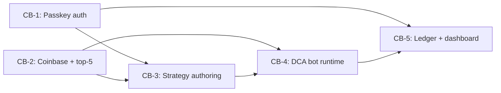

# MVP Bet Portfolio — Crypto DCA Bot

> The initial bet wedge — what we build together so the operator can complete the core value loop once. Bootstrap-only.

## MVP definition

> _Verbatim user answer to the forcing question:_ **"What does this product need to do for one real user to complete the core value loop once?"**

**"sign in with passkey, create a strategy, try it with paper money, once comfortable move to real money, log all transactions, review coinbase data to highlight the top 5 traded cryptos and use these cryptos for paper and real money"**

Every MVP bet below traces back to enabling some part of this loop.

## MVP bets

Bets that together enable the loop above. Each stub brief lives at `docs/bets/<bet-id>/brief.md` with `portfolio_stub: true` until promoted via `/create-brief <bet-id>`.

| Bet ID                        | Title                                             | One-line hypothesis                                                                                                                                                                                                                                                                                                                                                                | Type    | Depends on | Parallel with |
| ----------------------------- | ------------------------------------------------- | ---------------------------------------------------------------------------------------------------------------------------------------------------------------------------------------------------------------------------------------------------------------------------------------------------------------------------------------------------------------------------------- | ------- | ---------- | ------------- |
| [CB-1](../bets/CB-1/brief.md) | Passkey authentication                            | If the operator signs in via WebAuthn with a single passkey against a DB-validated signed-cookie session, every sensitive surface in [architecture.md § Authenticated surface enumeration](architecture.md#authenticated-surface-enumeration) is gated — implementing the primary access posture per [product.md § Identity & Access Posture](product.md#identity--access-posture) | feature | —          | CB-2          |
| [CB-2](../bets/CB-2/brief.md) | Coinbase data + top-5 discovery                   | If we wrap Coinbase Advanced Trade (CDP JWT auth) in `lib/coinbase/` and surface top-5 traded cryptos as a selectable set, every downstream bet has a single source of truth for Coinbase reads — implementing the **"review coinbase data to highlight the top 5"** clause                                                                                                        | feature | —          | CB-1          |
| [CB-3](../bets/CB-3/brief.md) | Strategy authoring + persistence                  | If the operator can author/edit/persist a named strategy (RSI + MA + sizes + caps, scoped to CB-2 cryptos), the **"create a strategy"** clause is satisfied and CB-4 has a typed config to read on every tick                                                                                                                                                                      | feature | CB-1, CB-2 | —             |
| [CB-4](../bets/CB-4/brief.md) | DCA bot runtime                                   | If the `*/15` cron reads the active strategy, evaluates RSI/MA signals deterministically, writes decisions to `bot_ticks`, and gates real-money order placement on `LIVE_MODE`, the **"try with paper money, then move to real money"** clause is satisfied                                                                                                                        | feature | CB-2, CB-3 | —             |
| [CB-5](../bets/CB-5/brief.md) | Transaction ledger + dashboard + override buttons | If the dashboard surfaces real-time bot state + full decision-trace history + pause/resume/force-buy/sell-N/reset controls, the **"log all transactions"** clause is satisfied and **"full decision-trace observability"** per [product.md § In scope](product.md#in-scope) is delivered                                                                                           | feature | CB-1, CB-4 | —             |

## Dependency graph

## Parallel-build candidates

- **Stream 1 (Day 1, no deps):** CB-1 (passkey auth) + CB-2 (Coinbase data + top-5 discovery) — independent foundations. Either of these is a meaningful Day-1 ship by itself.
- **Stream 2 (after Stream 1):** CB-3 (strategy authoring) — depends on CB-1 + CB-2; no parallel sibling at this stage.
- **Stream 3 (after CB-3):** CB-4 (bot runtime) — sequential; needs strategy config to read.
- **Stream 4 (after CB-4):** CB-5 (ledger + dashboard) — sequential; needs `bot_ticks` rows to display.

Critical path: CB-2 → CB-3 → CB-4 → CB-5 (4 sequential bets). The MVP is **largely a single critical path** with CB-1 as the one parallel companion to CB-2.

## Deliberately out of MVP

Captured so we don't lose them; **no stub briefs created**. Each returns later via `/create-brief <free-text>` once MVP ships and learnings settle.

- **Manual trading UI** — live price ticker, two-step order placement modal, open-orders list with cancel, manual trade history separation. **Deferred per operator follow-up during HITL** — operator can use Coinbase's own web UI for manual one-off trades during the dry-run phase. Returns post-MVP via `/create-brief manual-trading`. Trace: [product.md § In scope](product.md#in-scope) — "Manual trading pages".
- **Multi-device passkey registration + offline backup recovery code UX ceremony** — MVP ships with single passkey + absolute-last-resort manual DB recovery path (documented in [docs/ops/runbook.md](../ops/runbook.md)). Multi-device + backup code is a real hardening upgrade but operator can absorb the recovery risk during the n=1 dry-run-first phase. Trace: [product.md § Identity & Access Posture / Recovery posture](product.md#recovery-posture).
- **Auto-pause on drawdown + reserve floor enforcement** — Safety rails from the original brief. Operator self-monitors during dry-run phase; rails return as a `/create-brief` post-MVP. Real risk: if real-money mode happens before these are built, an unbounded drawdown is possible — but the MVP guardrail "operator runs dry-run for ≥ 60 sessions before flipping `LIVE_MODE`" (per [product.md § Annual KR1](product.md#annual-12-months-from-approval)) bounds the timeline pressure. Trace: [product.md § In scope](product.md#in-scope) — "Auto-pause on drawdown threshold", "Reserve floor".
- **Coinbase TS SDK final pick** (deferred from `/setup-foundation-architecture`) — Resolved during `/create-brief CB-2` promotion per [architecture.md DRI Issue #1](architecture.md). Listed here as a known open item; not a separate bet.
- **Backup recovery code UX ceremony** (deferred from `/setup-foundation-architecture`) — Same as multi-device passkey above. Listed here as a known open item; covered by the second bullet of this section.

## PM rationale

The MVP wedge spans **5 bets** with a 4-bet critical path (CB-2 → CB-3 → CB-4 → CB-5). Day-1 parallel pair (CB-1 + CB-2) collapses the auth-vs-data ordering question — both are foundational. After Stream 1, the wedge is largely sequential: strategy → bot → ledger/dashboard. The deliberate decisions to **defer manual trading UI, multi-device passkey, and auto-pause rails** keep MVP tightly focused on the operator's stated loop ("sign in → strategy → paper → live → review") — every bet in MVP enables a specific clause of that loop, nothing more.

## Promotion log

_Populated as each stub gets promoted to a full brief via `/create-brief <bet-id>`._

| Bet ID | Promoted on | Status after promotion |
| ------ | ----------- | ---------------------- |
| [CB-1](../bets/CB-1/brief.md) | 2026-05-31 | approved |
| [CB-2](../bets/CB-2/brief.md) | 2026-06-06 | approved |

## DRI Log

### Decisions

- [2026-05-31] [PM] **Five MVP bets (CB-1 through CB-5); 4-bet critical path** (CB-2 → CB-3 → CB-4 → CB-5) — SUPERSEDES the same-day initial 6-bet decision after operator follow-up deferred CB-6 (manual trading UI)
  - **Rationale (required):** the operator's verbatim MVP definition decomposes into 5 distinct functional surfaces (auth + data/top-5 + strategy + bot runtime + log/dashboard). Initial draft included a 6th bet for manual trading UI because the operator hadn't deferred it via the Q2 forcing question; on follow-up during HITL review the operator confirmed manual trading is out of MVP. Five bets is mid-range (3-6); each maps to a discrete surface from the operator's stated loop.
  - **Area (required, tag):** product / portfolio
  - **Alternatives considered (required):** keep 6 bets including CB-6 (rejected — operator explicitly deferred); 4 bets (merge ledger into bot runtime — rejected, dashboard is its own UI surface); 7 bets (split strategy into UI vs persistence — rejected as premature decomposition)
  - **Reversibility:** easy (portfolio is plan, not contract — bets can be merged or split during `/create-brief` promotion)
  - **Supersedes:** prior same-day 6-bet decision below; kept for trace.

- [2026-05-31] [PM] **(SUPERSEDED 2026-05-31)** Six MVP bets (CB-1 through CB-6); 4-bet critical path (CB-2 → CB-3 → CB-4 → CB-5)
  - **Rationale (required):** initial draft — manual trading (CB-6) included because operator did not deliberately defer it via the Q2 forcing question. Superseded after operator follow-up during HITL review.
  - **Area (required, tag):** product / portfolio
  - **Alternatives considered (required):** see superseding entry above
  - **Reversibility:** easy
  - **Superseded by:** the 5-bet decision above (this entry retained per append-only DRI convention).

- [2026-05-31] [PM] **CB-1 and CB-2 are the Day-1 parallel pair**; everything else sequences off them
  - **Rationale (required):** they share no dependencies and both unblock downstream work. Starting them together collapses the worst sequencing risk of the wedge.
  - **Area (required, tag):** portfolio / sequencing
  - **Alternatives considered (required):** start with CB-1 only (auth-first, sequential — rejected, wastes parallelism); start with CB-2 only and gate dashboard on auth later (rejected, auth needs full HITL ceremony so should start early)
  - **Reversibility:** easy

- [2026-05-31] [PM] **(SUPERSEDED 2026-05-31)** Manual trading UI (CB-6) included in MVP by non-deferral, not by explicit ask
  - **Rationale (required):** operator's verbatim MVP definition did not mention manual trading. The Q2 forcing question gave them an explicit chance to defer it; they did not. Honoring the "did not mark out → keep in" rule rather than overriding their non-answer with PM judgment. Flagging this in the brief stub itself so it can be reconsidered cheaply at promotion.
  - **Area (required, tag):** product / scope
  - **Alternatives considered (required):** defer manual trading anyway (rejected — would be the PM overriding the operator's signal); ask Q2 again with more options (rejected — operator had clear chance and chose not to defer it)
  - **Reversibility:** easy
  - **Superseded by:** the 2026-05-31 deferral decision below.

- [2026-05-31] [PM] **Defer manual trading UI (CB-6) to post-MVP per operator follow-up during HITL review**
  - **Rationale (required):** PM Risk #1 in the initial draft explicitly flagged that CB-6 had landed in MVP by non-deferral rather than by explicit ask, and recommended the operator reconsider before approval. Operator reconsidered and deferred. Stub at `docs/bets/CB-6/brief.md` deleted; entry added to [§ Deliberately out of MVP](#deliberately-out-of-mvp). Operator will use Coinbase's own web UI for manual one-off trades during the dry-run phase. Closes PM Risk #1.
  - **Area (required, tag):** product / scope
  - **Alternatives considered (required):** keep CB-6 (rejected — operator explicit follow-up deferred); narrow CB-6 to just price-view (no order placement) (rejected — even reduced UI still adds a non-load-bearing surface for MVP)
  - **Reversibility:** easy at portfolio level (this bet returns post-MVP via `/create-brief manual-trading`)

- [2026-05-31] [PM] **Skip mirroring to Confluence / Jira; document the skip per "no silent skips" principle**
  - **Rationale (required):** `compass/config.yaml` names `jira` + `confluence` connectors but no MCP credentials wired and no team consumes mirrored artifacts (solo operator). Consistent with the same skip-and-log pattern from [product.md PM Decision](product.md) and [architecture.md DRI Decision](architecture.md). Per AGENTS.md principle #3 (no silent skips), logged explicitly.
  - **Area (required, tag):** process
  - **Alternatives considered (required):** mirror with no consumers (rejected — overhead without function); wire up Jira mirroring (rejected — out of scope for MVP)
  - **Reversibility:** easy (can be wired later by amending `compass/config.yaml`)

- [2026-05-31] [Researcher] **Use comparable bot products (3Commas, Pionex, Cryptohopper) as MVP-wedge sanity check, not as scope drivers**
  - **Rationale (required):** comparable products typically ship MVP-usable with auth + balance read + one strategy + decision visibility + dry-run + (often) manual trading. The operator's stated loop overlaps with this pattern almost exactly; comparable MVP shape _corroborates_ the proposed wedge but does not justify expansion beyond the operator's verbatim answer. Resisting the Researcher-feature-creep anti-pattern from [`compass/roles/researcher.md`](../../compass/roles/researcher.md).
  - **Area (required, tag):** research / product
  - **Alternatives considered (required):** expand MVP to match the broadest comparable feature set (rejected — Researcher is sanity check, not scope driver); shrink MVP below comparables (rejected — operator's answer already maps to comparable MVP shape, no honest gap)
  - **Reversibility:** easy

### Risks

- [2026-05-31] [PM] **CB-6 (manual trading) may be quietly bloating MVP scope** — operator did not explicitly ask for it but did not defer it either
  - **Likelihood (required):** medium
  - **Impact (required):** medium (one extra bet = ~2 weeks of operator time at the stub's default estimate; shifts critical path completion modestly but doesn't gate any other bet)
  - **Mitigation (required):** explicit "reconsider this" note in the CB-6 brief stub; cheap to defer during `/create-brief CB-6` promotion if operator wants to shrink to 5; promotion log will record the decision
  - **Area (required, tag):** scope
  - **Resolution (filled when closed):** 2026-05-31 — operator followed up during HITL review and explicitly deferred CB-6 to post-MVP; stub deleted; entry added to [§ Deliberately out of MVP](#deliberately-out-of-mvp). MVP shrank from 6 → 5 bets. Mitigation worked as designed.

- [2026-05-31] [PM] **"Top-5 traded cryptos"** is ambiguous between operator's personal trading volume vs Coinbase's global top-5
  - **Likelihood (required):** certain (already observed in operator's MVP statement)
  - **Impact (required):** low (resolvable during CB-2 brief promotion; doesn't gate other bets; choice is reversible)
  - **Mitigation (required):** logged in [CB-2 brief stub](../bets/CB-2/brief.md) as "Open question — resolve at promotion." Default lean: operator's personal trading volume.
  - **Area (required, tag):** product / data
  - **Resolution (filled when closed):** 2026-06-06 — operator selected **global Coinbase 24h volume** at `/create-brief CB-2` promotion (NOT the original default lean). Recorded as PM DRI Decision #2 in [CB-2 brief](../bets/CB-2/brief.md#decisions). Also closed the related PM Issue below.

- [2026-05-31] [PM] **Auto-pause on drawdown + reserve floor deferred to post-MVP creates a real-money risk window**
  - **Likelihood (required):** low (mitigated by dry-run-first guardrail — ≥ 60 dry-run sessions before `LIVE_MODE=true`)
  - **Impact (required):** medium (uncapped drawdown possible if operator flips live too soon and these rails aren't built)
  - **Mitigation (required):** [product.md § Annual KR1](product.md#annual-12-months-from-approval) (≥ 60 dry-run sessions) is the timeline gate; auto-pause + reserve floor must ship as the first post-MVP bets, recorded here so they don't get forgotten
  - **Area (required, tag):** security / product

- [2026-05-31] [Researcher] **MVP wedge assumes one operator (n=1) — comparable product MVPs are all multi-user**
  - **Likelihood (required):** certain (acknowledged in [product.md § Out of scope](product.md#out-of-scope-never))
  - **Impact (required):** low (single-tenant is the deliberate product posture; no business-model risk at n=1)
  - **Mitigation (required):** if scope ever shifts to SaaS, triggers a foundation amend per [product.md § PM Risk #5](product.md); current wedge stays valid for the single-operator product the operator is building
  - **Area (required, tag):** strategic

- [2026-05-31] [Researcher] **Operator's "create a strategy" wording is ambiguous between hard-coded + tunable params vs full strategy-authoring UI**
  - **Likelihood (required):** certain
  - **Impact (required):** low (resolvable during CB-3 brief promotion; affects build effort within CB-3 but not bet count or dependencies)
  - **Mitigation (required):** logged in [CB-3 brief stub](../bets/CB-3/brief.md) as "Open question — resolve at promotion." Default lean: full authoring UI matches operator's verbatim word "create."
  - **Area (required, tag):** product / scope

### Issues

- [2026-05-31] [PM] Top-5 crypto discovery basis (operator's personal volume vs Coinbase global volume) — defer to CB-2 brief promotion
  - **Severity (required, mandatory):** P3
  - **Owner (required, mandatory):** PM (operator-resolved)
  - **Status:** closed 2026-06-06
  - **Area (required, tag):** product / data
  - **Resolution (filled when closed):** 2026-06-06 — operator chose **global Coinbase 24h volume** at `/create-brief CB-2` HITL. Resolution recorded as PM DRI Decision #2 in [CB-2 brief](../bets/CB-2/brief.md#decisions); Risk above (same topic) also closed.

- [2026-05-31] [PM] Strategy authoring depth (hard-coded + env tweaks vs full UI authoring) — defer to CB-3 brief promotion
  - **Severity (required, mandatory):** P3
  - **Owner (required, mandatory):** PM (operator-resolved)
  - **Status:** open
  - **Area (required, tag):** product / scope
  - **Resolution (filled when closed):** [to be filled during `/create-brief CB-3`]

---

_Approved by: <vivek> on <5/31/2026>_
